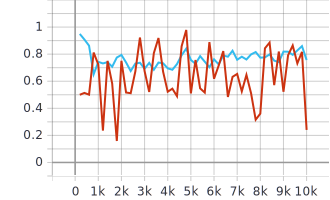

# DANN(Domain-Adversarial Neural Network)
Implementation of [DANN](https://arxiv.org/abs/1505.07818) in Tensorflow 2.0 environment, written for Deepest season 6 recruiting assignment.

## Assignment Requirements
### 1. Implementation of Gradient Reversal Layer(GRL)

``` python
@tf.custom_gradient
def GradientReversalOperator(x):
	def grad(dy):
		return -1 * dy
	return x, grad

class GradientReversalLayer(tf.keras.layers.Layer):
	def __init__(self):
		super(GradientReversalLayer, self).__init__()
		
	def call(self, inputs):
		return GradientReversalOperator(inputs)
```
Implemented in [/src/models.py](https://github.com/Joovvhan/dann_tf2.0/blob/master/src/models.py)

[@tf.custom_gradient](https://www.tensorflow.org/api_docs/python/tf/custom_gradient) decorator defines a tf operator with custom gradient.

**GradientReversalOperator** serves as an identity operator in forward pass and a gradient reversal operator in backward pass.

**GradientReversalLayer** is a child of keras layer class that wraps the custom operator.

---
### 2. Implementation of feature extractor, class classifier, domain classifier
``` python
self.feature_extractor = Sequential([
    Conv2D(filters=64, kernel_size=5, strides=1, kernel_regularizer=l2(0.001), padding='same', input_shape=input_shape),
    BatchNormalization(),
    Activation('relu'),
    MaxPooling2D(pool_size=3, strides=2),
    ...
    Flatten()            
])

self.label_predictor = Sequential([
    Dense(3072, kernel_regularizer=l2(0.001)),
    BatchNormalization(),
    Activation('relu'),
    Dropout(0.5),
    ...
    Dense(10, activation='softmax')
])

self.domain_classifier = Sequential([
    GradientReversalLayer(),
    Dense(1024, kernel_regularizer=l2(0.001)),
    ...
    Dense(2, kernel_regularizer=l2(0.001)),
    Activation('softmax')          
])		

self.predict_label = Sequential([
    self.feature_extractor,
    self.label_predictor
])

self.classify_domain = Sequential([
    self.feature_extractor,
    self.domain_classifier
])
```
Implemented in [/src/models.py](https://github.com/Joovvhan/dann_tf2.0/blob/master/src/models.py) as class variables of **DANN_Model** class using **tf.keras.Sequential**.

**feature_extractor** is a set of stacked convolutional layers with a **Flatten layer** in the end.

**label_predictor** predicts the label with stacked neural networks.

**domain_classifier** predicts the domain where the inputs comes from, 0 for a source, 1 for a target. A **GradientReversalLayer** is located at the front.

For all three architectures, both **MNIST** version and **SVHN** version from the original paper are implemented. The only difference from the original implementation is the existence of batch normalization layers.

**predict_label** concatenates the **feature_extractor** and the **label_predictor**. This path predicts the label of input images.

**classify_domain** concatenates the **feature_extractor** and the **domain_classifier**. This path predicts the domain of inputs images.

---
### 3. Resizing and normalizing input data
#### Input Normalization
``` python
def load_data(data_category):
    ...
    x_train = x_train[:TRAIN_NUM] / 255.0
    y_train = y_train[:TRAIN_NUM]

    x_test = x_test[:TEST_NUM] / 255.0
    y_test = y_test[:TEST_NUM]

    return (x_train, y_train, x_test, y_test)
```
Implemented in [/src/preprocessing.py](https://github.com/Joovvhan/dann_tf2.0/blob/master/src/preprocessing.py)
Pixel values are devided by maximum value(255).

#### Data Resize
``` python
def data2dataset(x, y, data_category):
    if (data_category == 'MNIST'):
        dataset = tf.data.Dataset.from_tensor_slices((x, y))
        dataset = dataset.map(pad_image)
        dataset = dataset.map(duplicate_channel)
        dataset = dataset.map(cast)
        dataset = dataset.shuffle(len(y))

    elif (data_category == 'SVHN' or data_category == 'SYN'):
        dataset = tf.data.Dataset.from_tensor_slices((x, y))
        dataset = dataset.map(cast)
        dataset = dataset.shuffle(len(y))
    return dataset
    
    def pad_image(x, y):
	paddings = tf.constant([[2, 2,], [2, 2]])
	new_x = tf.pad(x, paddings, "CONSTANT")
	return (new_x, y)

    def duplicate_channel(x, y):
	new_x = tf.stack([x, x, x], axis = -1)
	return (new_x, y)
```
Implemented in [/src/preprocessing.py](https://github.com/Joovvhan/dann_tf2.0/blob/master/src/preprocessing.py)

**data2dataset** prepares datasets as tf.data.Dataset.

MNIST dataset has image size of (28, 28, 1), and both SVHN and SynNumbers have image size of (32, 32, 3). Input image size of (32, 32, 3 ) is considered as appropriate.

**pad_image** function pads zeros around MNIST images, and **duplicate_channel** function stacks the same image by three times to create three channel image.

---
### 4. Prepare at least 2 datasets
As shown in section 3, 3 datasets are used to demonstrate implemented DANN.

60000 train data and 9000 test data from each datasets are used.

[MNIST](http://yann.lecun.com/exdb/mnist/)

[SVHN](http://ufldl.stanford.edu/housenumbers/)

[SynNumbers](https://drive.google.com/file/d/0B9Z4d7lAwbnTSVR1dEFSRUFxOUU/view)

---
### ~~5. Target classification accuracy above 70%~~

Results are shown in the extra(*) section.

---
### *. Comparison between source-only and DANN model

#### Source-only training results
|                              |  MNIST       | SVHN         | SynNumbers |
| :--------------------------: | :----------: | :----------: |:----------:|
| Source Training Accuracy     | 99.9%        | 99.7%        | 99.8%      |
| Source Test Accuracy         | 99.9%        | 91.5%        | 96.4%      |
| Target Accuracy(MNIST)       | -            | 71.3%        | 89.2%      |
| Target Accuracy(SVHN)        | 20.2%        | -            | 84.8%      |
| Target Accuracy(SynNumbers)  | 24.5%        | 91.1%        | -          |


**MNIST Source-only Training Graph**

| Accuracy | Loss |
|:---:|:---:|
|  |  |


**SVHN Source-only Training Graph**

| Accuracy | Loss |
|:---:|:---:|
|  |  |


**SynNumbers Source-only Training Graph**

| Accuracy | Loss |
|:---:|:---:|
|  |  |


---

#### SynNumbers to SVHN
|                              | SynNumbers   |
| :--------------------------: |:------------:|
| Source Training Accuracy     | 97.4%(-2.4%) |
| Source Test Accuracy         | 94.3%(-2.1%) |
| Target Accuracy(SVHN)        | 72.2%(-12.6%) |


**SynNumbers to SVHN Training Graph**

|| Accuracy | Loss |
|:---:|:---:|:---:|
|Label Prediction|  |  |
|Domain Classification|  |  |


---

#### SVHN to MNIST
|                              | SVHN          |
| :--------------------------: |:-------------:|
| Source Training Accuracy     | 94.3%(-5.4%)  |
| Source Test Accuracy         | 90.6%(-0.9%)  |
| Target Accuracy(MNIST)       | 61.0%(-10.3%) |


**SVHN to MNIST Training Graph**

|| Accuracy | Loss |
|:---:|:---:|:---:|
|Label Prediction|  |  |
|Domain Classification|  |  |


---

## Remarks

In this implementation, DANN showed poor performance in terms of classification accuracy compared to source only training.
First, I suspected that **GradientReversalLayer** was not working as I intended.
To examined the effect of the GRL, I performed PCA transformation of latent features (output of the feature extractor) from both source and target images.

**PCA Transformation Result During Source-only Training Process**

|| MNIST | SVHN | SynNumbers |
|:---:|:---:|:---:|:---:|
|PCA|  |  |  |
|TSNE|  |  |  |


**PCA Transformation Result During Source to Target Training Process**

|| SYN2SVHN | SVHN2MNIST |
|:---:|:---:|:---:|
|PCA|  |  | 
|TSNE|  |  | 

It is shown that SVHN and SynNumbers are not much distinguishable for both source-only and DANN cases.

On the other hand, features from MNIST are shown to be distinguishable for all source-only cases.

For SVHN to MNIST case, it seems that there are some confusion effects that mix features from two datasets together, yet SVHN and MNIST seems to be still distinguishable for most of the training time.

I assumed that GRL is working as I intend and that some other factors are affecting the poor perfomance of the DANN.

#### 1. Label prediction accuracy of the source data 

Compared to almost 100% prediction accuaracy for source training data in source-only training, DANN training showed lower accuracy in source datasets in both training and testing. It seems that gradient updates caused by feature extractor crippled the ability of the label predictor. I assumed that lowering the learning of the feature extractor would result in better performance.

#### 2. Accuracy of the domain classifier

The main idea of the GRL is based on the fact that negative gradient would leads to the opposite direction of the local minimum. However, for negative gradient to be in that desirable direction, original gradient should first be in the direction headed for local minimum. In other words, domain classifier should first know where the local minimum is. In this experiment, domain classifier showed prediction accuracy below 80% which means that original gradient update does not ensure the improvement closer to local minimum. In this case, gradient reversal layer would result in radomized gradient updates rather than getting away from the local minimum. I assumed that it is desirable to reach almost 100% in domain classification within first few epochs to validate negative gradient updates. 

#### 3. Similarity bewteen target and source datasets

To our common sense, SVHN and SynNumbers seem much similiar compared to MNIST and I believe that when similarity between the source and the target decreases, learning rate of feature extractor should be increased to confuse the model from distinguishing two datasets. 


Yet, I maintained same learning rate for every experiments and I believe changing learning rates and decays would result in better performance.

I am afraid such modification process is beyond my understanding that I finish my experiment with current progress.

---

## References

[Domain-Adversarial Training of Neural Networks](https://arxiv.org/abs/1505.07818)

[openTSNE](https://github.com/pavlin-policar/openTSNE)
